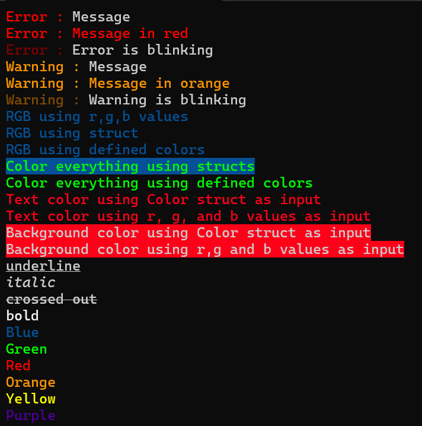

# Colors4Terminal

## Table of Contents

- [Overview](#overview)
- [About](#about)
- [Setup Instructions](#setup-instructions)
- [Known Issues](#known-issues)
- [Resources](#resources)

## Overview

- **Language**        :   C++
- **Libraries**       :   None
- **Build System**    :   None

## About

- A header only library designed for easy to use terminal messages.
- Error, Warning, Debug messages.
- Made for personal use.

## Setup Instructions

### Usage

1. Download the **KYCFT.h** file.

2. Add it to your project.

3. Include the header in your code : **KYCFT.h**.

4. Optional : Call **EnableVirtualTerminal()** at the start of your program.
	- In most cases this isn't required, but it ensures compatibility.

5. Don't forget to use the namespace 'CFT'.

6. For more information just read the comments in the header file.

## Known Issues

- Still in development.

## Resources

- [Ansi Escape Codes Wiki](https://en.wikipedia.org/wiki/ANSI_escape_code)	
